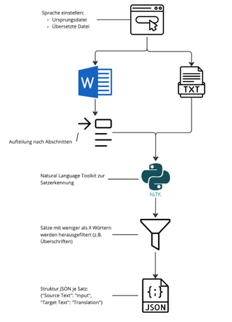
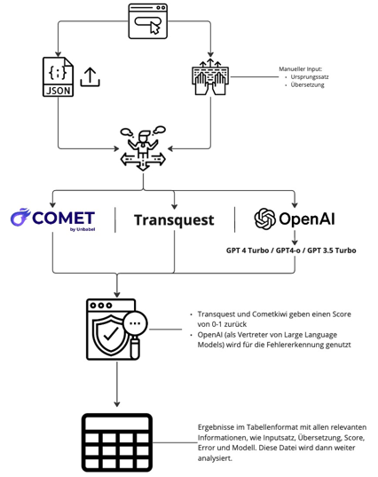
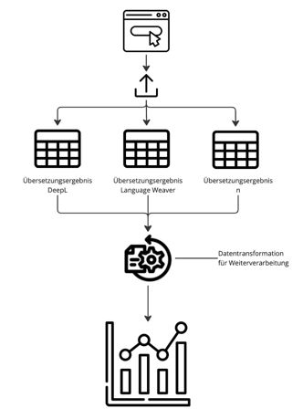

# Machine Translation Quality Estimation (MTQE) Project

Dieses Repository enthält die Implementierung eines Systems zur Qualitätsschätzung von maschinellen Übersetzungen (Machine Translation Quality Estimation, MTQE). Es umfasst mehrere Modelle, darunter **CometKiwi**, **OpenAI GPT** und **TransQuest**, sowie eine Frontend-Komponente zur Interaktion mit den Modellen.

## Inhalt

- **cometkiwi/**: Enthält die spezifische Implementierung und Konfiguration für das CometKiwi-Modell.
- **doc/**: Enthält Dokumentationen und zusätzliche Ressourcen zur Nutzung und Entwicklung dieses Projekts.
- **docker-compose.yml**: Konfigurationsdatei für Docker, um alle erforderlichen Dienste einfach zu starten.
- **frontend/**: Enthält die Benutzerschnittstelle (UI) und API-Endpunkte für die Interaktion mit den Modellen.
- **local_scripts/**: Verschiedene lokale Skripte für Tests und Analysen.
- **openai_gpt/**: Enthält die spezifische Implementierung und Konfiguration für das OpenAI GPT-Modell.
- **transquest/**: Enthält die spezifische Implementierung und Konfiguration für das TransQuest-Modell.

## Voraussetzungen

- **Docker**: Zum Ausführen der Anwendung in Containern.
- **Python 3.x**: Zum Ausführen lokaler Skripte und Analysen.
- **pipenv/virtualenv**: Für die Verwaltung von Python-Abhängigkeiten (optional, falls nicht Docker verwendet wird).

## Installation

1. **Repository klonen**:
   ```bash
   git clone <repository-url>
   cd <repository-folder>
2. **Umgebungsvariablen konfigurieren**:
Erstellen Sie eine .env-Datei im Stammverzeichnis und fügen Sie die notwendigen Umgebungsvariablen hinzu, wie in der Dokumentation beschrieben.
Eine Vorlage für die .env-Datei befindet sich im doc-Ordner unter dem Namen env_template.txt. Kopiere diese Datei und benenne sie in .env um:
   ```bash
   cp doc/env_template.txt .env
   ``` 
Öffne die .env-Datei und passe die Pfade und API-Tokens entsprechend deinem System und deinen Anforderungen an:

* Huggingface Token: Füge deinen Huggingface API-Token ein, um Zugriff auf Modelle und Ressourcen von Huggingface zu erhalten.
* OpenAI API Token: Füge deinen OpenAI API-Token ein, um die OpenAI GPT-Modelle zu nutzen.

Docker-Container starten:

```bash
docker-compose up -d
```
Zugriff auf die Anwendung:
Die Anwendung sollte nun unter http://localhost:8501 erreichbar sein.

## Nutzung

- **Frontend**: Interagieren Sie über die bereitgestellte UI.
- **Modelle**: Die spezifischen Modelle können über die konfigurierten Endpunkte angesprochen werden, um die Übersetzungsqualität zu bewerten.

## CometKiwi XL Modell
Das CometKiwi XL Modell ist zu groß, um direkt über GIT versioniert zu werden. Daher wurde das Modell nicht im Repository gespeichert, sondern muss lokal von Huggingface heruntergeladen und implementiert werden.

### Lokale Implementierung des Modells
Um das CometKiwi XL Modell lokal zu verwenden, lade es direkt von Huggingface herunter und speichere es auf deinem lokalen System unter `cometkiwi/wmt23-cometkiwi-da-xl/`. Anschließend kannst du es in dein Projekt integrieren.

### Zukünftige Verbesserungen
In der Zukunft könnte das GIT-Repository durch GIT LFS (Large File Storage) erweitert werden, um große Dateien wie Modelle effektiv zu verwalten und versionieren zu können. Dies würde es ermöglichen, das CometKiwi XL Modell und ähnliche große Dateien direkt im Repository zu speichern und zu versionieren.

## Lokale Skripte

Die lokalen Skripte im Ordner `local_scripts/` können für spezifische Analysen und Tests genutzt werden. Stellen Sie sicher, dass die benötigten Abhängigkeiten installiert sind und die Umgebungsvariablen korrekt gesetzt wurden.

## Dokumentation

Weitere Informationen zur Nutzung, API-Dokumentation und technischen Details finden Sie im Ordner `doc/`.

## Dashboard Übersicht



